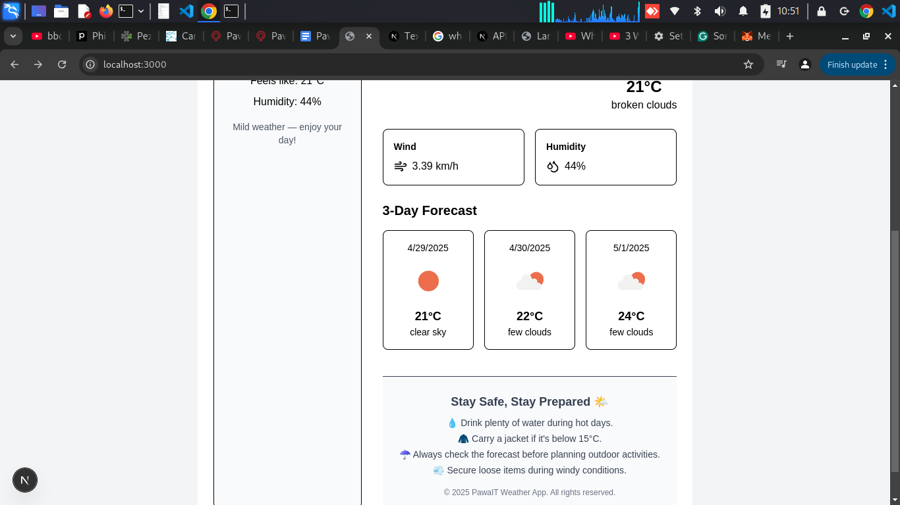
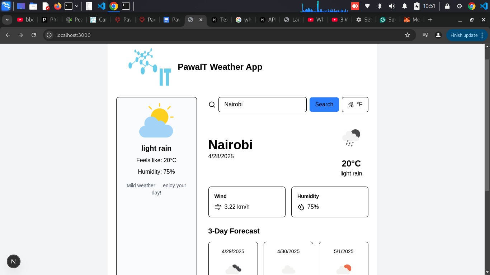

🌤️ PawaIT Weather Application

A modern weather application built with Next.js (TypeScript) for the frontend and Laravel (latest) for the backend API. This app fetches real-time weather data from the OpenWeatherMap API and presents it in a clean, responsive UI.





🧭 Project Overview
This project demonstrates a decoupled architecture where:

The Next.js frontend handles the user interface and communicates with the backend via AJAX requests.

The Laravel API backend processes requests and fetches weather data from the OpenWeatherMap API.

The OpenWeatherMap API provides current weather data for any location.

The application is designed to be modular, scalable, and easy to maintain.

🛠️ Technology Stack
Frontend
Next.js – React framework for building server-rendered applications.

TypeScript – Superset of JavaScript that adds static types.

Tailwind CSS – Utility-first CSS framework for rapid UI development.

RippleUI – Component library built with Tailwind CSS.

Fetch API – Native JavaScript API for making HTTP requests.

Backend
Laravel (latest version) – PHP framework for building RESTful APIs.

Guzzle – HTTP client for making requests to external APIs.

External API
OpenWeatherMap API – Provides weather data for any location.

🚀 Features
   Current Weather Display: Shows temperature, humidity, wind speed, and weather description.
   City Search: Allows users to search for weather by city name.
   Responsive Design: Optimized for both desktop and mobile devices.
   Error Handling: Displays user-friendly messages for invalid inputs or API errors.

🛠️ Installation & Setup
   Backend (Laravel API)
   Clone the repository:

1. Clone repo
   ```bash
   git clone https://github.com/yourusername/weather-app.git
   cd weather-app/backend
   Install dependencies:

2. Setting up environment
   ```bash
   composer install
   Set up environment variables:

3. 
   ```bash
   cp .env.example .env
   Update the .env file with your OpenWeatherMap API key.
   


4. Generate application key:
   ```bash
   php artisan key:generate
   Serve the application:

5. 
   ```bash
   php artisan serve
   The API will be available at http://localhost:8000.
   
6. Frontend Side
   ```bash   
   Frontend (Next.js)
   Navigate to the frontend directory:
   
7. 
   ```bash
   cd ../frontend
   Install dependencies:
   
8. 
   ```bash
   npm install
   Start the development server:

9. 
   ```bash
   npm run dev
   The application will be available at http://localhost:3000.
   Open the frontend application in your browser.
   
   
10. 
   ```Enter a city name in the search bar and press Enter.
   View the current weather information displayed on the screen.
   


